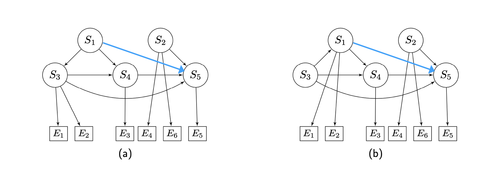

## Problem 20: Classical NEMs
### Construct the transitive closure
 

In the following adjacency matrices $\Phi$ a non zero ij'th element in the matrix indicates that node $S_i$ is connected to $S_j$. 

$$
\Phi_a = \begin{bmatrix}
0 & 1 & 1 & 1 & 1 \\
0 & 0 & 0 & 0 & 1 \\
0 & 0 & 0 & 1 & 1 \\
0 & 0 & 0 & 0 & 1 \\
0 & 0 & 0 & 0 & 0 
\end{bmatrix}
$$

$$
\Phi_b = \begin{bmatrix}
0 & 1 & 0 & 1 & 1 \\
0 & 0 & 0 & 0 & 1 \\
1 & 0 & 0 & 1 & 1 \\
0 & 0 & 0 & 0 & 1 \\
0 & 0 & 0 & 0 & 0 
\end{bmatrix}
$$