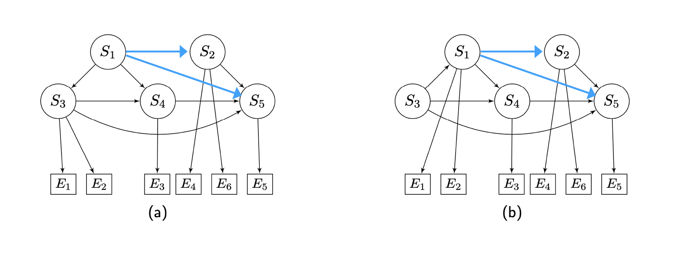

```{r setup, include=FALSE}
knitr::opts_chunk$set(echo = TRUE)
```

## Problem 20: Classical NEMs

### 1. For each model, construct the transitive closure (by adding edges) and define the corresponding adjacency matrices $\Phi$ and $\Theta$, which represent the signalling pathways and the E-gene attachments. Determine the corresponding expected effect patterns (F).


#### Construct phi
```{r}
phi1 = t(array(c(c(1,0,1,1,1),
                c(0,1,0,0,1),
                c(0,0,1,1,1),
                c(0,0,0,1,1),
                c(0,0,0,0,1)),
                dim = c(5, 5), dimnames = list(c("S1", "S2", "S3", "S4", "S5"),
                                             c("S1", "S2", "S3", "S4", "S5"))))

phi2 = t(array(c(c(1,0,0,1,1),
                c(0,1,0,0,1),
                c(1,0,1,1,1),
                c(0,0,0,1,1),
                c(0,0,0,0,1)),
                dim = c(5, 5), dimnames = list(c("S1", "S2", "S3", "S4", "S5"),
                                             c("S1", "S2", "S3", "S4", "S5"))))
```
#### a) $\Phi$
```{r}
phi1
```
#### b) $\Phi$
```{r}
phi2
```
#### Construct thetha
```{r}
theta1 = array(dim = c(5,6), dimnames = list(c("S1", "S2", "S3", "S4", "S5"),
                                             c("E1", "E2", "E3", "E4", "E5","E6")))
theta1["S1",] = c(0,0,0,0,0,0)
theta1["S2",] = c(0,0,0,1,0,1)
theta1["S3",] = c(1,1,0,0,0,0)
theta1["S4",] = c(0,0,1,0,0,0)
theta1["S5",] = c(0,0,0,0,1,0)

theta2 = array(dim = c(5,6), dimnames = list(c("S1", "S2", "S3", "S4", "S5"),
                                             c("E1", "E2", "E3", "E4", "E5","E6")))
theta2["S1",] = c(1,1,0,0,0,0)
theta2["S2",] = c(0,0,0,1,0,1)
theta2["S3",] = c(0,0,0,0,0,0)
theta2["S4",] = c(0,0,1,0,0,0)
theta2["S5",] = c(0,0,0,0,1,0)
```
#### a) $\Theta$
```{r}
theta1
```
#### b) $\Theta$
```{r}
theta2
```
#### Calculate $F = \Phi \Theta$
```{r}
F1 = phi1%*%theta1
F2 = phi2%*%theta2
```
#### a) $F$
```{r}
F1
```
#### b) $F$
```{r}
F2
```
### 2. Assuming no noise, determine the discrete data D1 and D2 from both models. Given only the data, can you tell apart the two models?
```{r}
D1 = array(dim = c(6, 5), dimnames = list(c("E1", "E2", "E3", "E4", "E5","E6"),
                                          c("S1", "S2", "S3", "S4", "S5")))

D1["E1",] = c(1,0,1,0,0)
D1["E2",] = c(1,0,1,0,0)
D1["E3",] = c(1,0,1,1,0)
D1["E4",] = c(0,1,0,0,0)
D1["E5",] = c(1,1,1,1,0)
D1["E6",] = c(0,1,0,0,1)

D2 = array(dim = c(6, 5), dimnames = list(c("E1", "E2", "E3", "E4", "E5","E6"),
                                          c("S1", "S2", "S3", "S4", "S5")))

D2["E1",] = c(1,0,1,0,0)
D2["E2",] = c(1,0,1,0,0)
D2["E3",] = c(1,0,1,1,0)
D2["E4",] = c(0,1,0,0,0)
D2["E5",] = c(1,1,1,1,0)
D2["E6",] = c(0,1,0,0,1)

```
#### a) $D1$
```{r}
D1
```
#### 2) $D2$
```{r}
D2
```
Since the Data matrices D1 and D2 are identical, we cannot tell the two models apart.

### 3. Use the mnem1 package for this question: Take D1 and D2 from the previous question. For each model, calculate the marginal log-likelihood ratio (network score) given the data by setting the false positive rate to be $5%$ and the false negative rate to be $1%$.

```{r}
library(mnem)
network_score_1 = scoreAdj(D1,adj = phi1,method="disc",marginal=TRUE,fpfn=c(0.05,0.01))$score
network_score_2 = scoreAdj(D2,adj = phi2,method="disc",marginal=TRUE,fpfn=c(0.05,0.01))$score

```

#### Network score of (a)
```{r}
network_score_1
```

#### Network score of (b)
```{r}
network_score_2
```

## Problem 21: Hidden Markov NEMs

### 1. Using the defnitions for HM-NEMs from the lecture, compute the transition probabilities from $G_{t} = u$ to $G_{t+1} \in {v1, v2}$ for different smoothness parameter $\lambda \in {0.1, \dots 0.9}$.

```{r}
u = t(array(c(c(1,1,1,0),
              c(0,1,1,1),
              c(0,0,1,1),
              c(0,0,0,1)),
              dim = c(4, 4), dimnames = list(c("S1", "S2", "S3", "S4"),
                                             c("S1", "S2", "S3", "S4"))))
v1 = t(array(c(c(1,1,1,0),
              c(0,1,1,1),
              c(0,0,1,0),
              c(0,0,0,1)),
              dim = c(4, 4), dimnames = list(c("S1", "S2", "S3", "S4"),
                                             c("S1", "S2", "S3", "S4"))))
v2 = t(array(c(c(1,0,0,0),
              c(1,1,1,0),
              c(1,0,1,0),
              c(1,0,0,1)),
              dim = c(4, 4), dimnames = list(c("S1", "S2", "S3", "S4"),
                                             c("S1", "S2", "S3", "S4"))))

lambda = seq(0.1, 0.9, by=0.1)

s_uv1 = sum(u!=v1)
s_uv2 = sum(u!=v2)
w = mnem:::enumerate.models(c("S1","S2","S3","S4"),trans.close = FALSE)
s_uw = array(dim = c(length(w), 1))
for(i in 1:length(w)){
  s_uw[i] = sum(u!=w[[i]])
}

power <- function(x, y) sign(x) * abs(x)^y

T = array(dim = c(9,2), dimnames = list(lambda,c("v1", "v2")))
C = array(dim = c(9,1), dimnames = list(lambda,c("C")))
for(i in lambda){
  C[as.character(i),] = sum(power((1-i),s_uw)*i)
  T[as.character(i),"v1"] = (1/C[as.character(i),])*((1-i)^s_uv1)*i
  T[as.character(i),"v2"] = (1/C[as.character(i),])*((1-i)^s_uv2)*i
}
```

#### Transition probabilities
```{r}
T
```

### 2. Plot the transition probabilities for $v_{1}$ and $v_{2}$ as a function of $\lambda$. Describe the transition probabilities as a function of $\lambda$.

```{r}
library(reshape2)
library(ggplot2)
library(RColorBrewer)
data = data.frame(melt(T))
colnames(data)<-c("lambda","v","T")
plot<-ggplot(data,aes(x=lambda,y=T,color=v))+
  geom_point()+
  theme_classic()+
  ylab("Transition probaility")+
  labs(title="Transition probabilities as a function of lambda")
plot

```

As $\lambda$ increases the similarity between networks becomes more relevant for the transition probabilities, that is, dissimilar networks get more highly penalized with a lower transition probability as $\lambda$ increases. Since $v_1$ is more similar to $u$ than $v_2$, the probability to transition into $v_1$ increases as we increase $\lambda$. Conversely as we bring $\lambda$ close to zero, network similarity becomes less relevant and we see the transition probabilities of $v_1$ and $v_2$ converge.

## Problem 22: Mixture NEMs

### 1. Determine the the cellular perturbation map $\rho$, where $\rho_{ic} = 1$ if cell c is perturbed by a knock-down of S-gene $i$.

```{r}
rho = array(dim = c(2,4), dimnames = list(c("S1","S2"),
                                          c("C1", "C2", "C3", "C4")))
rho["S1",] = c(1,0,1,0)
rho["S2",] = c(0,1,1,1)
rho
```

### 2. Assume that ${C_{1},C_{2}}$ are generated from $F_{1}$ and ${C_{3},C_{4}}$ are generated from $F_{2}$, compute the noiseless log odds matrix $R$, where $R_{jc} > 0$ means that the perturbation on cell $c$ has an effect on E-gene $j$:

#### (a) For each component $k$, compute the expected effect pattern $(\rho^{T}\phi^{k}\theta^{k})^{T}$. Replace all non-zeros by 1.

```{r}
phi_F1 = array(dim = c(2,2), dimnames = list(c("S1","S2"),
                                             c("S1","S2")))
phi_F1["S1",] = c(1,1)
phi_F1["S2",] = c(0,1)

phi_F2 = array(dim = c(2,2), dimnames = list(c("S1","S2"),
                                             c("S1","S2")))
phi_F2["S1",] = c(1,0)
phi_F2["S2",] = c(1,1)

theta_F1 = array(dim = c(2,2), dimnames = list(c("S1","S2"),
                                               c("E1","E2")))
theta_F1["S1",] = c(1,0)
theta_F1["S2",] = c(0,1)

theta_F2 = array(dim = c(2,2), dimnames = list(c("S1","S2"),
                                               c("E1","E2")))
theta_F2["S1",] = c(0,1)
theta_F2["S2",] = c(1,0)

EEP_F1 = t(t(rho)%*%phi_F1%*%theta_F1)
EEP_F1[EEP_F1>1] = 1
EEP_F2 = t(t(rho)%*%phi_F2%*%theta_F2)
EEP_F2[EEP_F2>1] = 1
```
#### Expected effect pattern of F1
```{r}
EEP_F1
```
#### Expected effect pattern of F2
```{r}
EEP_F2
```

#### (b) Based on the component assignment for each cell, extract the corresponding column from the expected effect patterns computed above and put it into R. Replace all zeros by $-1$.

```{r}
R= cbind(EEP_F1[,1:2],EEP_F2[,3:4])
R[R==0] = -1

R
```

### 3. Take R from the previous question. Given the vector of mixture weights $\pi = (0.44, 0.56)$, calculate the responsibilities $\Gamma$. Then, update the mixture weights.

```{r}
L1 = t(EEP_F1)%*%R
L2 = t(EEP_F2)%*%R
print("L1")
L1
print("L2")
L2
pi = c(0.44,0.56)

gamma = array(dim = c(2,4), dimnames = list(c("F1","F2"),
                                            c("C1", "C2", "C3", "C4")))
gamma["F1",] = pi[1]*exp(diag(L1))/(pi[1]*exp(diag(L1))+pi[2]*exp(diag(L2)))
gamma["F2",] = pi[2]*exp(diag(L2))/(pi[2]*exp(diag(L2))+pi[1]*exp(diag(L1)))
```

#### Responsibilities
gamma

```{r}
pi[1] = sum(gamma["F1",])/(sum(gamma["F1",])+sum(gamma["F2",]))
pi[2] = sum(gamma["F2",])/(sum(gamma["F1",])+sum(gamma["F2",]))
```
#### Updated mixture weights

```{r}
pi
```


